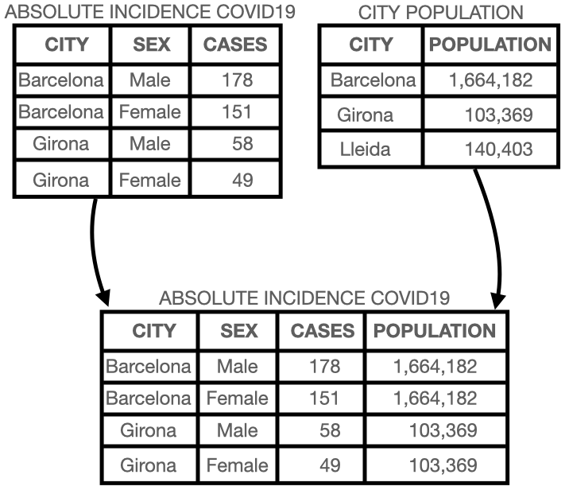
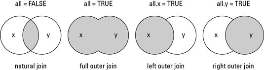

```{r setup, include=FALSE, cache=FALSE}
options(htmltools.dir.version = FALSE, width=80)
knitr::opts_chunk$set(warning = FALSE, 
                      message = FALSE, 
                      cache=FALSE,
                      comment="", 
                      prompt=TRUE,
                      include=FALSE,
                      echo=FALSE,
                      fig.path = "img/")

## from http://yihui.name/knitr/hooks#chunk_hooks
knitr::knit_hooks$set(small.mar=function(before, options, envir) {
                        if (before) par(mar=c(4, 5, 1, 1)) ## smaller margin on top and right
})
```

class: title-slide, middle, center

# Data manipulation and plotting with R

## Robert Castelo & Mireia Ramos
[robert.castelo@upf.edu](mailto:robert.castelo@upf.edu)
[mireia.ramos@upf.edu](mailto:mireia.ramos@upf.edu)
### Dept. of Experimental and Health Sciences
### Universitat Pompeu Fabra

<br>

## Fundamentals of Computational Biology
### BSc on Human Biology
### UPF School of Health and Life Sciences
### Academic Year 2021-2022

---
class: center, middle, inverse

# Control flow statements

---

## Control flow statements

* Sequentially evaluated statements may be written one below another using
  newlines or in the same line separated by semicolons (`;`):
<pre>
i <- 1 ; j <- 0
</pre>
* Conditional and looping statements have the condition surrounded by
  parentheses `( )` and the associated code by braces `{ }` (except in single lines).
<pre>
if (i > 0)
&nbsp;&nbsp;j <- i * 10
&nbsp;&nbsp;
while (i < j) {
&nbsp;&nbsp;i <- i + 1
&nbsp;&nbsp;print(i)
}
&nbsp;&nbsp;
for (i in 1:10) {
&nbsp;&nbsp;j <- j + i
&nbsp;&nbsp;print(j)
}
</pre>

---

## Interpretation and vectorization

* The R language is interpreted, vectorized and includes implicit memory
  management.  
  &nbsp;&nbsp;
* Looping statements are slow in R. The following example would be a (wrong)
  approach in R following a classical programming style:
  <pre>
  x <- 1:100
  logsum <- 0
  for (i in 1:length(x)) {
      logsum <- logsum + log(x[i])
  }
  </pre>
* This would be the vectorized (right) approach in R:
  <pre>
  logsum <- sum(log(x))
  </pre>

---

## Lists and Implicit looping

* In some cases we might still want to iterate through some specific elements.  
  &nbsp;&nbsp;
* R provides a more compact way to iterate over lists, and other objects, by using
  functions for implicit looping:
  * `lapply()` returns a list with the same length as the input, where each element
    is the result of the applied function.
  * `sapply()` attempts to simplify the resulting data structure, returning a 
    vector if the length of each list element is 1.
* To use this approach we usually want to convert out data into a list to be able
  to iterate through it. The `split()` function is the most efficient way to do it,
  as it will split an object (vector, data frame) into the groups defined by a factor
  variable.

---

## Lists and Implicit looping: an example

* In every R session you can access by default a `data.frame` object called `iris`
corresponding to a classical data set on the taxonomic characteristics of flowers
used by
[Fisher (1936)](https://onlinelibrary.wiley.com/doi/pdf/10.1111/j.1469-1809.1936.tb02137.x)
to introduce certain statistical concepts. It contains measurements of the flowers of
fifty plants for each of the three species _Iris setosa_, _Iris versicolor_ and
_Iris virginica_.
<pre>
> head(iris)
      Sepal.Length Sepal.Width Petal.Length Petal.Width Species
1          5.1         3.5          1.4         0.2  setosa
2          4.9         3.0          1.4         0.2  setosa
3          4.7         3.2          1.3         0.2  setosa
4          4.6         3.1          1.5         0.2  setosa
5          5.0         3.6          1.4         0.2  setosa
6          5.4         3.9          1.7         0.4  setosa
> levels(iris$Species)
[1] "setosa"     "versicolor" "virginica" 
</pre>


---

## Lists and Implicit looping: an example

* Long way, using explicit looping:
<pre>
> means_all <- c()
&nbsp;&nbsp;
> for (i in levels(iris$Species)) {
&nbsp;&nbsp;mask <- iris$Species == i
&nbsp;&nbsp;sepal_lengths <- iris$Sepal.Length[mask]
&nbsp;&nbsp;mean <- mean(sepal_lengths)
&nbsp;&nbsp;means_all <- c(means_all, mean)
}
&nbsp;&nbsp;
> names(means_all) <- levels(iris$Species)
&nbsp;&nbsp;
> means_all
  setosa versicolor  virginica 
   5.006      5.936      6.588 
</pre>

---

## Lists and Implicit looping: an example

* Short way, using **implicit** looping:

<pre>
> sepal_list <- split(iris$Sepal.Length, iris$Species)
&nbsp;&nbsp;
> sapply(sepal_list, mean)
  setosa versicolor  virginica 
   5.006      5.936      6.588 
</pre>

```{r}
head(iris)
levels(iris$Species)

## Long way
means_all <- c()
for (i in levels(iris$Species)) {
  mask <- iris$Species == i
  sepal_lengths <- iris$Sepal.Length[mask]
  mean <- mean(sepal_lengths)
  means_all <- c(means_all, mean)
}
names(means_all) <- levels(iris$Species)
means_all

## Short way
sepal_list <- split(iris$Sepal.Length, iris$Species)
sapply(sepal_list, mean)
```


---

## Concluding remarks

* Control flow statements can conditionally execute code surrounded by braces.
  Identation is only necessary for readability.  
  &nbsp;&nbsp;
* Vectorized operations are much faster than loops.  
  &nbsp;&nbsp;
* Lists and implicit looping are a very efficient way to apply functions to 
  specific groups of data.
  

---
class: center, middle, inverse

# Data manipulation


---

## Sorting and ordering data

* In some cases we might be interested in sorting or ordering our objects. 
  <pre>
  > numbers <- round(runif(15, min=0, max=50))
  > numbers
   [1] 47 34 45 24 18  0  3  3 15 24 37 31 34 26  6
  </pre>
* There are two main functions to do this:
  * `sort()` allows to sort a vector into ascending or descending order.
    <pre>
    > sort(numbers, decreasing=FALSE)
    [1]  0  3  3  6 15 18 24 24 26 31 34 34 37 45 47
    </pre>
  * `order()` returns a permutation of the positions of the input vector that
    is typically used to rearrange a vector into ascending or descending order,
    as well as the rows or columns of `matrix` and `data.frame` objects.
    <pre>
    > order(numbers, decreasing=FALSE)
    [1]  6  7  8 15  9  5  4 10 14 12  2 13 11  3  1
    </pre>

```{r}
numbers <- round(runif(15, min=0, max=50))
numbers
sort(numbers, decreasing=FALSE)
order(numbers, decreasing=FALSE)
```


---

## Sorting and ordering data

* Example of using `order()` to sort the rows of a `data.frame` object:
<pre>
> dat1 <- data.frame(COUNTY=c("OSONA", "MARESME", "SEGRIA"),
                         POPULATION=c(180364, 506901, 233615))
> dat1
       COUNTY POPULATION
1   OSONA     180364
2 MARESME     506901
3  SEGRIA     233615
> dat1[order(dat1$COUNTY), ]
       COUNTY POPULATION
2 MARESME     506901
1   OSONA     180364
3  SEGRIA     233615
> dat1[order(dat1$POPULATION), ]
       COUNTY POPULATION
1   OSONA     180364
3  SEGRIA     233615
2 MARESME     506901
</pre>


---

## Pasting rows and columns

* Several rows and columns can be _pasted_ into a data frame using:
  * `cbind()` to paste columns.
    <pre>
    > dat2 <- data.frame(COUNTY=c("OSONA", "MARESME", "SEGRIA"),
                             VACCINATION=c(119624, 343637, 156648))
    > dat3 <- cbind(dat1, VACCINATION=dat2[, "VACCINATION"])
    > dat3
           COUNTY POPULATION VACCINATION
    1   OSONA     180364      119624
    2 MARESME     506901      343637
    3  SEGRIA     233615      156648
    </pre>

`r emo::ji("warning")` __Important__: When pasting data you have to make sure 
that they have the same dimensions. In the case of pasting columns with `cbind`,
`data.frame` objects must have the same number of rows.

---

## Pasting rows and columns

* Several rows and columns can be _pasted_ into a data frame using:
  * `rbind()` to paste rows.
  <pre>
  > dat4 <- data.frame(COUNTY="SELVA", POPULATION=191432,
                             VACCINATION=122082)
  > dat5 <- rbind(dat3, dat4)
  > dat5
           COUNTY POPULATION VACCINATION
  1   OSONA     180364      119624
  2 MARESME     506901      343637
  3  SEGRIA     233615      156648
  4   SELVA     191432      122082
  </pre>

  
```{r}
dat1 <- data.frame(COUNTY=c("OSONA", "MARESME", "SEGRIA"),
                   POPULATION=c(180364, 506901, 233615))
dat2 <- data.frame(COUNTY=c("OSONA", "MARESME", "SEGRIA"),
                   VACCINATION=c(119624, 343637, 156648))
dat3 <- cbind(dat1, VACCINATION=dat2[, "VACCINATION"])
dat4 <- data.frame(COUNTY="SELVA", POPULATION=191432,
                   VACCINATION=122082)
dat5 <- rbind(dat3, dat4)
```

`r emo::ji("warning")` __Important__: When pasting data you have to make sure 
that they have the same dimensions. In the case of pasting rows with `rbind`,
`data.frame` objects must have the same number of columns with identical column names.


---

## The recycling rule

* When performing operations between vectors of different length, R
  follows a specific policy called the _recycling_ rule, by which the
  shorter vector is _recycled_.  
  &nbsp;&nbsp;
* This rule is straightforward when the length of the longer vector is multiple
  of the length of the shorter vector:
  <pre>
  > 2 * 1:4
  [1] 2 4 6 8
  > 2:3 * 1:4
  [1] 2  6  6  12
  </pre>
* When the length of the longer vector is not multiple of the length of the
  shorter vector, R issues a warning:
  <pre>
  > 2:3 * 1:5
  [1] 2  6  6 12 10
  Warning message:
  In 2:3 * 1:5 :
    longer object length is not a multiple of shorter object length
  </pre>


---

## Adding columns

* We can add a new column to a `data.frame` object by doing an assignment of a
  vector of values on that new column, specified with either the `[[` or the `$`
  operator, followed by the name of the new column.
&nbsp;&nbsp;
* You can perform operations with columns and other columns and/or vectors and 
store the result in a new column.
  <pre>
  > dat5$VPERCENTAGE <- 100 * dat5$VACCINATION / dat5$POPULATION
  > dat5
       COUNTY POPULATION VACCINATION VPERCENTAGE
  1   OSONA     180364      119624    66.32366
  2 MARESME     506901      343637    67.79174
  3  SEGRIA     233615      156648    67.05391
  4   SELVA     191432      122082    63.77304
  </pre>
* Note that, in the above line, R applied the recycling rule, reusing the
  value `100` to multiply every value in the vector resulting from the
  division operation.


---

## Combining datasets

* Combining datasets of different dimensions is one of the most common
  operations performed for answering questions from data.



* In this example, once we combine the city population with
  the absolute incidence, we can now calculate the relative
  incidence per 100,000 inhabitants:
  <pre>
  > dat$CASESPER100K <- 100000 * dat$CASES / dat$POPULATION
  </pre>


---

## Combining datasets: `match()`

* `match()`: returns a vector of the positions of (first) matches
  of its first argument in its second.
  <pre>
  > datinc <- data.frame(CITY=c("Barcelona", "Barcelona",
                                  "Girona", "Girona"),
                           SEX=c("Male", "Female", "Male", "Female"),
                           CASES=c(178, 151, 58, 49))
  > datpop <- data.frame(CITY=c("Barcelona", "Girona", "Lleida"),
                           POPULATION=c(1664182, 103369, 140403))
  > mt <- match(datinc$CITY, datpop$CITY)
  > mt
  [1] 1 1 2 2
  > datinc$POPULATION <- datpop$POPULATION[mt]
  > datinc
           CITY    SEX CASES POPULATION
  1 Barcelona   Male   178    1664182
  2 Barcelona Female   151    1664182
  3    Girona   Male    58     103369
  4    Girona Female    49     103369
  </pre>


```{r}
datinc <- data.frame(CITY=c("Barcelona", "Barcelona", "Girona", "Girona"),
                     SEX=c("Male", "Female", "Male", "Female"),
                     CASES=c(178, 151, 58, 49))
datpop <- data.frame(CITY=c("Barcelona", "Girona"),
                     POPULATION=c(1664182, 103369))
mt <- match(datinc$CITY, datpop$CITY)
mt
datinc$POPULATION <- datpop$POPULATION[mt]
datinc
```

---

## Combining datasets: `merge()`

* `merge()`: combine two `data.frame` objects by common columns or row names,
  or do other versions of database [_join_](https://en.wikipedia.org/wiki/Relational_algebra#Joins_and_join-like_operators) operations. We can specify different column
  names for _joining_ using the arguments `by.x` and `by.y`.
  <pre>
  > merge(datinc, datpop)
           CITY    SEX CASES POPULATION
  1 Barcelona   Male   178    1664182
  2 Barcelona Female   151    1664182
  3    Girona   Male    58     103369
  4    Girona Female    49     103369
  </pre>

```{r}
merge(datinc, datpop)
```
  

---

## Combining datasets: `merge()`

* Parameters `all`, `all.x` and `all.y` in the `merge()` function control
  the way in which non-matching rows are returned, and their possible settings
  correspond to different type of _join operations_.  
  &nbsp;&nbsp;

.footer[Image from [R for Dummies, _How to use the merge() function with data sets in R_.](https://www.dummies.com/programming/r/how-to-use-the-merge-function-with-data-sets-in-r)]
  <pre>
  > merge(datinc, datpop, all=TRUE)
           CITY    SEX CASES POPULATION
  1 Barcelona   Male   178    1664182
  2 Barcelona Female   151    1664182
  3    Girona   Male    58     103369
  4    Girona Female    49     103369
  5    Lleida   &lt;NA&gt;    NA     140403
  </pre>

---

## Concluding remarks

* Analyzing data involves so-called
  [data wrangling](https://en.wikipedia.org/wiki/Data_wrangling)
  steps in which we may have to reorder data, paste rows and columns,
  combine datasets or add new columns.  
  &nbsp;&nbsp;
* The recycling rule is a powerful feature, but beware of situations
  in which it may be unintentionally applied.  
  &nbsp;&nbsp;
* It is important to understand the difference between `sort` and `order`.  
  &nbsp;&nbsp;
* Pasting rows and columns is straightforward with `rbind()` and `cbind()`.  
  &nbsp;&nbsp;
* Most of the times, we will be interested in the _natural join_ operation,
  in which we combine rows from two datasets with **matching values in a common
  column**. This can be achieved either with the `match()` function or the
  `merge()` function with default parameters.

---
class: center, middle, inverse

# Plotting with R

---

## Generic plot types in R

* The basic plotting function in R is `plot()`.  
  &nbsp;&nbsp;
* The first element (`x`) is what will be represented in the x axis and the 
  second element (`y`) what will be shown in the y axis.  
  &nbsp;&nbsp;
* You can specify the type of plot that should be drawn using the argument `type`.
  Some examples are: `type = "p"` for points, `type = "l"` for lines or `type="b"`
  for both.
  <pre>
  plot(x=iris$Sepal.Length, y=iris$Sepal.Width, type="p") 
  </pre>
```{r example-plot, out.width="70%", include=TRUE, fig.asp=.6}
plot(x=iris$Sepal.Length, y=iris$Sepal.Width, type="p")
```

---

## Modifying plot graphical parameters

* There are many graphical parameters that can be changed to make the plots more
  attractive, such as the axis labels or the coloring.  
  &nbsp;&nbsp;
* A list can be found at the `plot()` function documentation: `?graphics::plot`
  <pre>
  plot(x=iris$Sepal.Length, y=iris$Sepal.Width, type="p",
         xlab = "Iris sepal length", ylab = "Iris sepal width",
         pch = 19, cex = 1.5,
         col=c("red", "blue", "green")[iris$Species])
  </pre>

```{r example-plot-mod, out.width="70%", include=TRUE, fig.asp=.6}
plot(x=iris$Sepal.Length, y=iris$Sepal.Width, type="p", 
     xlab = "Iris sepal length", ylab = "Iris sepal width",
     main = "Scatterplot",
     pch = 19, cex = 1.5,
     col=c("red", "blue", "green")[iris$Species]) # Only works when the variable is a FACTOR
```

---

## Modifying plot graphical parameters

* `xlab` and `ylab`. Titles for the x and y axes, respectively.  
  &nbsp;&nbsp;
* `main`. Title for the plot.  
  &nbsp;&nbsp;
* `pch`. Shape of the points (full description at `? pch`)


* `cex`. Number indicating how much the symbols should be scaled relative to the
  default.  
  &nbsp;&nbsp;
* `col`. Colors for the lines and points. You can specify a single or multiple 
  colors (one for each point).

---

## Other types of plots

* A _barplot_ is used to represent a categorical variable such as a factor in the 
  x axis and a numeric value in the y axis.  
  &nbsp;&nbsp;
* The function `barplot()` creates a bar plot with vertical or horizontal bars by
  just providing their height as a vector. The vector names will be used to plot
  the x axis labels.
  <pre>
  barplot(table(iris$Species), col=2:4, 
            xlab="Species", ylab="Number of observations")
  </pre>

```{r barplot-example, include=TRUE, out.width="50%", fig.asp=.85}
barplot(table(iris$Species), col=2:4, xlab="Species", ylab="Number of observations")
```


---

## Other types of plots

* A _boxplot_ is used to plot the distribution of a continuous (numeric) variable
  over different groups (factors).  
  &nbsp;&nbsp;
* The function `boxplot()` produces this specific plot, by providing a formula 
  `y ~ grp`, where`y` is a numeric vector and `grp` is a grouping variable 
  (usually a factor).
  <pre>
  boxplot(iris$Sepal.Length ~ iris$Species, col=2:4, 
            xlab = "Species", ylab = "Sepal length")
  </pre>

```{r boxplot-example, include=TRUE, out.width="50%", fig.asp=.85}
boxplot(iris$Sepal.Length ~ iris$Species, col=2:4, 
        xlab = "Species", ylab = "Sepal length")
```


---

## Combine plots using `par()`

* The function `par()` allows setting or inquiring about some specific graphical
  parameters, explained in the help section `?par`.  
  &nbsp;&nbsp;
* We can specify the number of subplots we need using the argument `mfrow = c(nr, nc)`, 
  where `nr` are the number of rows and nc` the number of columns you want to 
  divide your device into.
  <pre>
  par(mfrow=c(1,2))
  barplot(table(iris$Species), col=2:4, cex.names=.9)
  boxplot(iris$Sepal.Length ~ iris$Species, col=2:4, cex.axis=.85)
  </pre>

```{r combine-plots, include=TRUE, out.width="70%", fig.asp=.5, small.mar=TRUE}
par(mfrow=c(1,2))
barplot(table(iris$Species), col=2:4, cex.names=.9)
boxplot(iris$Sepal.Length ~ iris$Species, col=2:4, cex.axis=.85)
```


---

## Concluding remarks

* There are different functions to produce plots in R. The one you use will 
  depend on the type of data you have.  
  &nbsp;&nbsp;
* Additional graphical parameters can be modified by providing them as 
  arguments to the plotting functions.  
  &nbsp;&nbsp;
* You can combine plots side-by-side by using the function _par()_.

---

## Bonus track: the Tidyverse

The [tidyverse](https://www.tidyverse.org/) is an opinionated collection of R 
packages designed for data science. All packages share an underlying design 
philosophy, grammar, and data structures.

```{r hex-ggplot2, out.width="10%", include=TRUE}
knitr::include_graphics("https://d33wubrfki0l68.cloudfront.net/2c6239d311be6d037c251c71c3902792f8c4ddd2/12f67/css/images/hex/ggplot2.png")
```

* _[ggplot2](https://ggplot2.tidyverse.org/)_. System for creating
  graphics, based on The Grammar of Graphics. You provide the data, tell ggplot2
  how to map variables to aesthetics and it takes care of the details. 
  
```{r, out.width="10%", include=TRUE}
knitr::include_graphics("https://d33wubrfki0l68.cloudfront.net/621a9c8c5d7b47c4b6d72e8f01f28d14310e8370/193fc/css/images/hex/dplyr.png")
```

* _[dplyr](https://dplyr.tidyverse.org/)_. Provides a grammar of data manipulation, 
  with a consistent set of verbs that solve the most common data manipulation 
  challenges. 

---

## Bonus track: the Tidyverse

The [tidyverse](https://www.tidyverse.org/) is an opinionated collection of R 
packages designed for data science. All packages share an underlying design 
philosophy, grammar, and data structures.


```{r, out.width="10%", include=TRUE}
knitr::include_graphics("https://d33wubrfki0l68.cloudfront.net/476fa4025501dcec05be08248b32d390dd2337d5/574c6/css/images/hex/tidyr.png")
```

* _[tidyr](https://tidyr.tidyverse.org/)_. Provides a set of functions that help 
  you get to tidy data. Tidy data is data with a consistent form: in brief, every 
  variable goes in a column, and every column is a variable. 


> Online book [R for Data Science](https://r4ds.had.co.nz) by [Hadley Wickham](http://hadley.nz).


